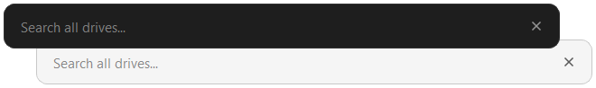

<h1 align="center">Seekbar</h1>

  <b>Minimalist cross-platform file search. One bar, every drive.</b> 
  Native per-OS backends, with an <code>os.scandir</code> walk as universal fallback.

  
  
  
  
  
  
  

  

---

<h2 align="center">Quick start</h2>

  Download the latest build from <a href="https://github.com/Solganis/Seekbar/releases">Releases</a> and run it, or run from source:

  <code>uv sync</code> &nbsp;then&nbsp; <code>uv run seekbar</code>

<h2 align="center">Features</h2>

  <b>Native backends</b> - NTFS MFT on Windows, Spotlight on macOS, <code>plocate</code>/<code>locate</code> on Linux 
  <b>Flexible matching</b> - underscores, hyphens, and spaces are interchangeable; token order doesn't matter 
  <b>Smart ranking</b> - results scored by match quality and recency, streamed as they are found 
  <b>Keyboard-driven</b>, frameless, with a system tray and a global hotkey (Ctrl+Alt+S, Windows and macOS) 
  <b>Dark / light / auto theme</b> with system detection

<h2 align="center">Keyboard shortcuts</h2>

<table>
<tr><td><kbd>Ctrl+Alt+S</kbd></td><td>Show / hide window (global, Windows and macOS)</td></tr>
<tr><td><kbd>F1</kbd></td><td>Toggle shortcuts help</td></tr>
<tr><td><kbd>Enter</kbd></td><td>Open selected file</td></tr>
<tr><td><kbd>Esc</kbd></td><td>Clear search text, then close window</td></tr>
<tr><td><kbd>Ctrl+T</kbd></td><td>Cycle theme (auto / light / dark)</td></tr>
<tr><td><kbd>Ctrl+Q</kbd></td><td>Quit application</td></tr>
<tr><td><kbd>Up</kbd> / <kbd>Down</kbd></td><td>Navigate results</td></tr>
<tr><td><kbd>Page Up</kbd> / <kbd>Page Down</kbd></td><td>Jump by page</td></tr>
<tr><td><kbd>Home</kbd> / <kbd>End</kbd></td><td>Jump to first / last result</td></tr>
<tr><td><kbd>F2</kbd></td><td>Donate links</td></tr>
</table>

